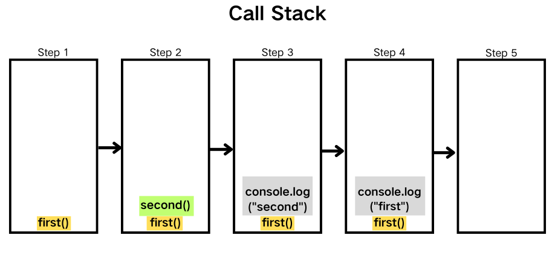

### JavaScript 引擎

JavaScript 引擎是执行 JavaScript 代码的程序。最流行的 JavaScript 引擎包括谷歌的 V8 引擎（用于 Chrome 和 Node.js）、Mozilla 的 SpiderMonkey（用于 Firefox）以及 Safari 的 JavaScriptCore（也称为 Nitro）。这些引擎负责将 JavaScript 代码编译成机器码，并在计算机上运行。

JavaScript 引擎通常由以下几个部分组成：

1. 解析器：将源代码转换成抽象语法树（AST）。
2. 解释器：读取和执行 AST。
3. 编译器：将高频执行的代码编译为优化后的机器码，提高执行效率。

在现代引擎中，解释器和编译器通常协同工作，通过即时编译技术，动态优化代码执行。

### JavaScript 运行时

JavaScript 运行时是一个包含执行 JavaScript 代码所需的所有元素的环境。在浏览器中，运行时包括以下几个主要部分：

1. JavaScript 引擎：如上所述，负责解析和执行代码。
2. Web API：浏览器提供的 API，例如 DOM、定时器（Timers）、Fetch 等，用于与浏览器功能交互。
3. 事件循环：协调代码执行、事件和回调函数，保证代码非阻塞地运行。

### 调用堆栈

JavaScript 是一门单线程的语言，这意味着它只有一个调用栈，因此，它同一时间只能做一件事。每当一个函数被调用时，它会被添加到调用堆栈的顶部，当函数执行完毕后，它会从堆栈顶部移除。

调用堆栈遵循后进先出原则，即最后被添加到堆栈的函数最先被执行。例如：

```js
function first() {
  second();
  console.log("first");
}

function second() {
  console.log("second");
}

first();
```

执行结果为:

```
second
first
```



### 事件循环

事件循环是 JavaScript 运行时的核心机制之一。它负责监控调用堆栈和消息队列，并按照顺序处理队列中的任务。事件循环的工作流程如下：

1. 检查调用堆栈：如果堆栈为空，则继续，否则执行堆栈中的函数。
2. 检查消息队列：如果队列中有任务，将任务推入调用堆栈并执行。
3. 重复上述步骤，直到没有任务需要处理。

事件循环确保了 JavaScript 的异步特性，使得单线程的 JavaScript 能够处理复杂的 I/O 操作而不阻塞主线程。
